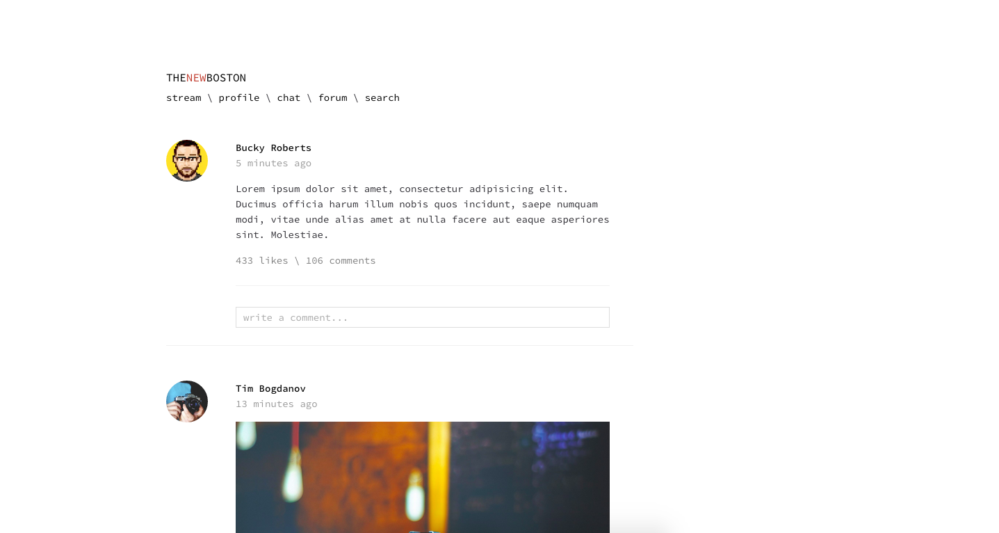

# dayFive: thenewboston
A ten day challenge that I've challenged myself to do. dayFive is a concept template for [thenewboston.com](http://thenewboston.com/) where programmers meet and socialize

# Sources used
Devtips Starter Kit:
[Get on GitHub](https://github.com/DevTips/DevTips-Starter-Kit)

Bourbon.io:
[Visit officail site](http://bourbon.io/)

thenewboston Website:
[Visit site](http://thenewboston.com/)

